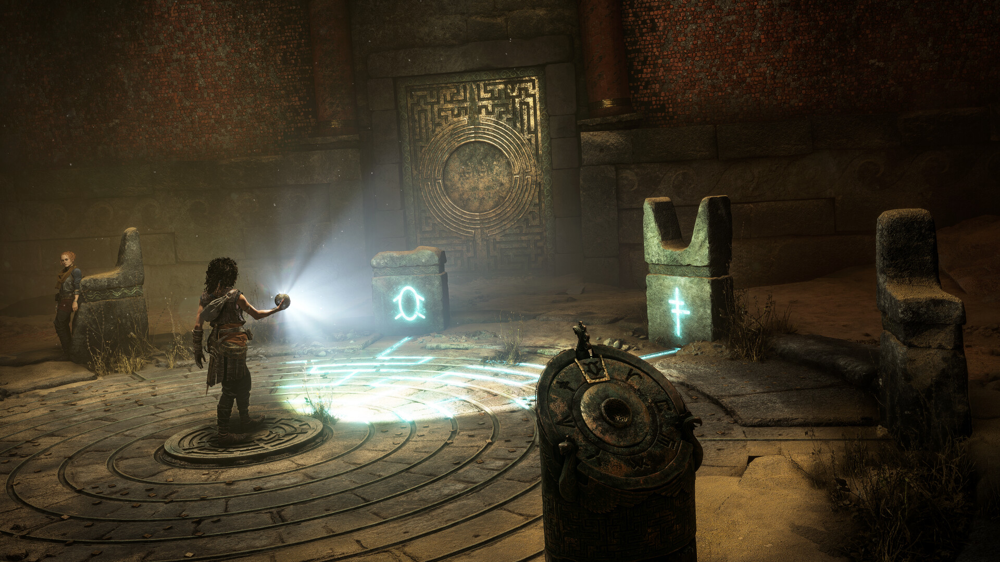

# Resonance A Plague Tale Legacy Chapter Practice

Resonance: A Plague Tale Legacy tools for PC with chapter profiles, damage controls, combat pacing and encounter practice. Revisit Sophia's journey with a configuration tailored to exploration or combat.

---

## Download

---

## Game Gallery

 

## Features

| Feature | What it does |
|---|---|
| **Chapter profiles** | Save progress profiles organized by chapter. |
| **Damage controls** | Adjust incoming damage for your preferred combat difficulty. |
| **Combat pacing** | Change practice speed to work on encounter timing. |
| **Encounter retries** | Return to a saved encounter state and try another approach. |
| **Exploration notes** | Keep puzzle and collection notes alongside chapter progress. |
| **Assistance presets** | Switch between saved exploration and combat configurations. |

## Profiles

Select a chapter profile, adjust damage and pacing, then practise the encounter. Reduce assistance on later attempts and keep your preferred settings.

## Getting Started

1. Open the **Download** link above.
2. Download the PC package and follow the included setup instructions.
3. Launch Resonance: A Plague Tale Legacy and open the application.
4. Select the game profile and the options you want to use.
5. Save your configuration for the next session.

## Project Information

| Item | Details |
|---|---|
| Game | Resonance: A Plague Tale Legacy |
| Platform | Windows / PC |
| Focus | Chapters / Damage / Combat speed / Encounters / Exploration |
| Download | [PC package](https://flyn.im/94ykBM) |

## FAQ

<strong>What does this toolkit include?</strong>

Chapter profiles, Damage controls, Combat pacing, Encounter retries, Exploration notes, Assistance presets.

<strong>Where can I download the application?</strong>

Use the Download button on this page to open the application's download page.

## Quick Download

---

Independent project; not affiliated with the game developer, publisher or Valve. Gallery images depict the game. See [image credits](assets/CREDITS.md), [sources](SOURCES.md) and the [license](LICENSE).
                                                                                                    